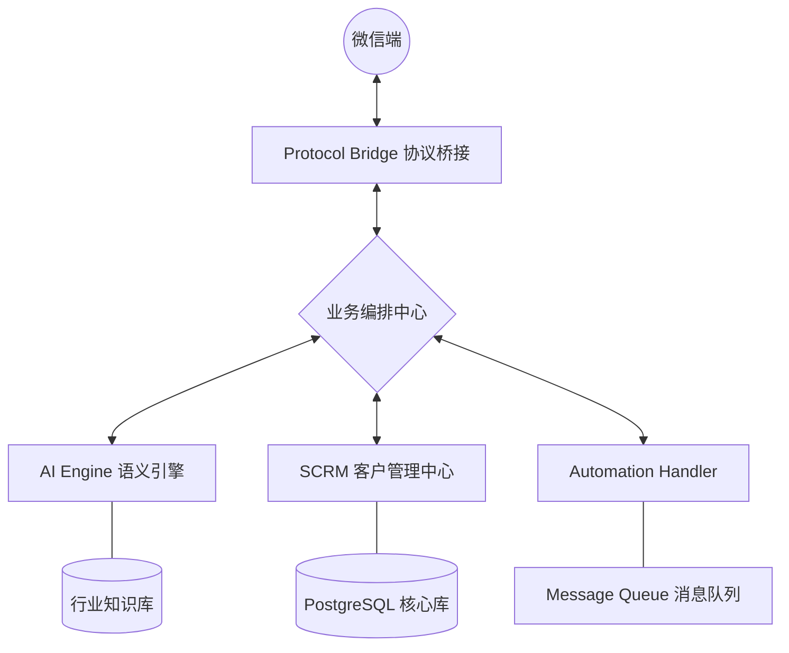

# 🤖 wx-bot4 - 企业级 AI 数字员工与私域运营大脑 (Enterprise AI Agent)

> **wx-bot4** 是一款专为企业打造的 **AI 数字员工** 系统。它通过深度集成 **DeepSeek / GPT-4 / Claude** 等大语言模型，真正实现了微信私域流量的 **全自动获客、精准打标、朋友圈运营与智能转化**。
> 它是您在微信生态中 7x24 小时永不疲倦的“金牌销售”与“资深运营”。

---

## 🌟 核心功能深度解析 (Core Features)

为了让搜索更精准触达您的需求，我们将 wx-bot4 的核心能力进行了详细拆解。这些功能专为解决 **获客难、管理乱、转化低** 的私域痛点而生：

### 1. 🤖 AI 数字员工：拟真化智能对话
-   **高情商沟通**：超越死板的关键词回复，AI 能理解上下文、情绪与潜台词。支持针对不同行业定制专属的人格设定（Persona）。
-   **知识库深度训练**：支持导入 PDF、Docx、网页等多种格式的企业内部资料，打造行业级专家 IP，确保 AI 回复的专业性与准确性。
-   **多轮引导转化**：AI 会主动根据预设的销售路径（SOP）引导客户留下联系方式或完成下单，实现“静默转化”。

### 2. 🏷️ 智能精准打标：用户画像全自动化
-   **意图实时分析**：通过 NLP 技术，实时识别客户意图，自动打上 `高潜客户`、`价格敏感`、`竞品对比` 等多维度标签。
-   **画像深度沉淀**：根据聊天内容自动提取客户的行为偏好，自动同步至内置 SCRM 库。
-   **标签联动营销**：根据标签自动触发不同的营销策略，提升二次复购率。

### 3. 👥 私域获客管理：全自动扩充流量池
-   **全自动加好友**：支持通过手机号、微信号、QQ 号批量搜索并添加好友，被动好友请求秒级自动通过。
-   **智能迎新打招呼**：新好友通过后，AI 立即根据来源渠道发送针对性的首聊语，快速建立第一印象。
-   **客户分流机制**：支持根据关键词或权重将新流量自动分配，实现负载均衡。

### 4. 🎡 朋友圈自动化：SOP 级全天候运营
-   **定时自动发圈**：支持多账号矩阵式自动发布朋友圈，内容可由 AI 结合热点与行业痛点自动生成。
-   **点赞评论互动**：AI 自动识别好友朋友圈内容，进行点赞或极具人情味的评论互动，维持账号活性。
-   **营销热度追踪**：自动统计朋友圈的互动数据，分析客户最感兴趣的内容类型。

### 5. 📩 批量精准触达：告别盲目群发
-   **意向分级群发**：根据 AI 标记的标签进行筛选，只给“有需求”的客户发消息，极大降低投诉率。
-   **定时、定量、分批次**：内置高级调度算法，模拟真人发送频率，支持在客户最活跃的时段自动触达。
-   **多模态消息支持**：支持批量发送文本、语音、图片、小程序链接、视频号视频等。

### 6. 🛡️ 独家防封技术：模拟真人路径安全无忧
-   **反屏蔽算法**：基于自研的底层通信协议，模拟手机终端行为，包括点击、滑动、停留时间等操作。
-   **独立 IP 路由**：支持对接代理池，确保每个机器人账号拥有独立的网络指纹，降低封号风险。
-   **行为随机化**：AI 自动生成随机的作息时间与互动偏好，使每个账号看起来都像真实的运营人员。

---

## 🏗️ 系统架构 (Technical Architecture)

wx-bot4 采用模块化、高性能的异步微服务架构，具备极强的扩展性与安全性。

---

## 💻 源码库架构预览 (Core Architecture)

本项目开放了 **160+ 核心模块** 的架构定义与接口实现，完整展示了企业级私域系统的设计思想。

*   **[/core/ai/](./core/ai/)**: 意图分类、情感分析、LLM 适配、多轮对话流、知识库检索增强（RAG）。
*   **[/core/crm/](./core/crm/)**: 标签生命周期、线索评分权重、分群逻辑、行业 SOP 模板库。
*   **[/core/handler/](./core/handler/)**: 朋友圈全自动执行器、批量群发引擎、智能回复路由、入群自动欢迎。
*   **[/core/security/](./core/security/)**: 防封行为模拟器、IP 代理调度、加密通信标准、异动告警系统。
*   **[/core/orchestrator/](./core/orchestrator/)**: 复杂业务流编排、任务优先级队列、状态机分布式一致性管理。

---

## 📸 产品界面展示 (Screenshots)

  

  
<b>✨ 点击查看系统全功能截图 (100% 真实系统演示)</b>

   
  
  
  
  
  
  
  
  
  
  
  
  
  
  
  
  
  
  
  
  
  
  
  
  
  
  
  
  
  
  
  
  
  
  
  
  
  
  
  
  
  

---

## 💼 商业合作与源码获取

wx-bot4 现已开放**完整版源码授权**。

- 🚀 **标准商业版**：包安装部署，支持 7x24 小时技术保障。
- 💻 **高级源码版**：提供全套前后端源码，支持私有化部署、二次开发。

> **立即联系我们，开启您的 AI 私域革命！**

### 📞 联系我们

| **微信咨询 (扫码添加)** | **QQ 咨询 (扫码添加)** |
| :---: | :---: |
|  |  |
| **微信号：(请扫码查看)** | **QQ 号：3696205806** |

---

*© 2026 wx-bot4 Team. All rights reserved.*
